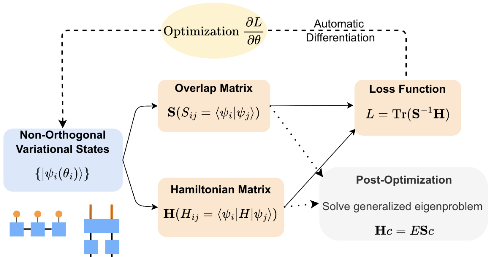

# A Unified Variational Framework for Quantum Excited States

This repository contains the implementation of a novel variational principle for calculating quantum excited states, as described in our manuscript: https://arxiv.org/abs/2504.21459. The method enables simultaneous determination of multiple low-energy excited states by minimizing $\Tr(\mathbf{S}^{-1}\mathbf{H})$, where $\mathbf{H}$ and $\mathbf{S}$ are the Hamiltonian and overlap matrices constructed from non-orthogonal variational states.

## Contents

Simultaneous optimization of multiple excited states without explicit orthogonality constraints with implementation for various physical systems:

- 1D Heisenberg spin chains using Matrix Product States
- Vibrational spectrum calculations using Quantics Tensor Trains
- 2D fermionic Hubbard model with variational quantum circuits

## Installation

This work is enabled by the infrastructure based provided by [TensorCircuit-NG](https://github.com/tensorcircuit/tensorcircuit-ng).
